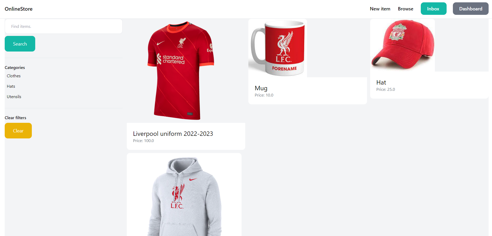
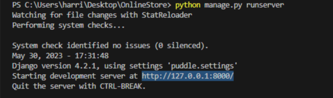

# OnlineStore

<b>Project Overview:</b>

OnlineStore is a  web application utilizing Python, HTML, and the Django Framework. It serves as an e-commerce platform dedicated to football merchandise, facilitating both the sale and purchase of items. 
  Sellers can list their products, while buyers can browse and acquire desired merchandise. Communication between buyers and sellers is facilitated through messaging functionality. 
  Additionally, the platform features a front page showcasing the latest arrivals, along with user-friendly category filters for efficient item exploration.
  
  
  

  
  

<b>How to Run:</b>

  -Clone this project.

  

  -Use an IDE (for example: VS code) to open project.

  
  -Change directory to project. In terminal, type "python manage.py runserver".

  Paste the following into web browser url to run the web application.

